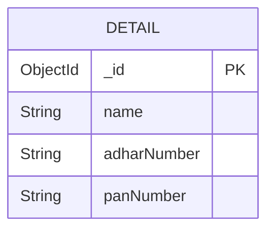

# 📝 Udyam Backend Detailed Documentation

Welcome to the comprehensive documentation of the **Udyam** backend! This guide covers the core files in the repository, explains their purposes, illustrates how they interconnect, and provides interactive API reference blocks for every endpoint.

---

## 📑 Index

1. [Overview & Architecture](#-overview--architecture)  
2. [Schema: `Schema/detailsSchema.js`](#-schema-schemadetailsschemajs)  
3. [Controller: `controller/adharController.js`](#-controller-controlleradharcontrollerjs)  
4. [Library: `lib/connectDb.js`](#-library-libconnectdbjs)  
5. [Router: `routes/dataRouter.js`](#-router-routesdatarouterjs)  
6. [Server Entry: `server.js`](#-server-entry-serverjs)  
7. [Deployment Config: `vercel.json`](#-deployment-config-verceljson)  
8. [Entity Relationship Diagram](#-entity-relationship-diagram)  
9. [API Endpoints](#-api-endpoints)  

---

## 🔧 Overview & Architecture

The Udyam backend is a Node.js/Express application that manages Aadhaar & PAN verification via OTP workflows and persists user details in MongoDB using Mongoose.

```mermaid
flowchart LR
    A[Client] -->|HTTP Request| B[Express Server<br/>(server.js)]
    B --> C[/data Router/]
    C --> D{Controller<br/>(adharController.js)}
    D --> M[Detail Model<br/>(detailsSchema.js)]
    B --> E[DB Connector<br/>(connectDb.js)]
    E -->|MongoDB Connection| F[(MongoDB)]
```

---

## 🎨 Schema: `Schema/detailsSchema.js`

**Purpose:** Defines the **`Detail`** Mongoose model representing user records with Aadhaar & PAN.

```javascript
const mongoose = require("mongoose");

const detailSchema = new mongoose.Schema({
  name: {
    type: String,
    required: true,
    minlength: [4, "Name should be at least 4 characters"],
    maxlength: [48, "Name cannot exceed 48 characters"],
  },
  adharNumber: {
    type: String,
    required: true,
    unique: true,
    validate: {
      validator: v => /^\d{12}$/.test(v),
      message: props => `${props.value} is not a valid 12-digit Aadhaar number!`
    }
  },
  panNumber: {
    type: String,
    uppercase: true,
    unique: true,
    validate: {
      validator: v => /^[A-Z]{5}[0-9]{4}[A-Z]$/.test(v),
      message: props => `${props.value} is not a valid PAN number!`
    }
  }
});

module.exports = mongoose.model("Detail", detailSchema);
```

- **Fields:**  
  | Field         | Type   | Constraints                                                    |
  | ------------- | ------ | -------------------------------------------------------------- |
  | `name`        | String | Required, 4–48 chars                                           |
  | `adharNumber` | String | Required, unique, exactly 12 digits                             |
  | `panNumber`   | String | Optional, unique, format `ABCDE1234F` (uppercased)             |

---

## 🛠️ Controller: `controller/adharController.js`

**Purpose:** Houses all business logic for handling user data, OTP generation/verification for Aadhaar & PAN, and uniqueness checks.

```javascript
const Detail = require("../Schema/detailsSchema");

// 1️⃣ Handle generic data save (/data POST)
async function handleAdhar(req, res) { /* ... */ }

// 2️⃣ Check existing Aadhaar (/data/checkAadhaarUnique POST)
async function handleAadhaarUnique(req, res) { /* ... */ }

// 3️⃣ Check existing PAN (/data/checkPanUnique POST)
async function handlePanUnique(req, res) { /* ... */ }

// Utility: Verhoeff algorithm for Aadhaar
function isValidAadhaar(raw) { /* ... */ }

// In-memory OTP stores
const otpStore = new Map();
const panOtpStore = new Map();

// Utility: Generate 6-digit OTP
function generateOtp() { /* ... */ }

// 4️⃣ Aadhaar OTP generation (/data/generateOtp POST)
async function generateAadhaarOtp(req, res) { /* ... */ }

// 5️⃣ Aadhaar OTP verification (/data/verifyOtp POST)
async function verifyAadhaarOtp(req, res) { /* ... */ }

// Utility: Simple regex PAN check
function isValidPAN(raw) { /* ... */ }

// 6️⃣ PAN OTP generation (/data/generatePanOtp POST)
async function generatePanOtp(req, res) { /* ... */ }

// 7️⃣ PAN OTP verification (/data/verifyPanOtp POST)
async function verifyPanOtp(req, res) { /* ... */ }

module.exports = {
  handleAdhar,
  handleAadhaarUnique,
  handlePanUnique,
  generateAadhaarOtp,
  verifyAadhaarOtp,
  generatePanOtp,
  verifyPanOtp,
  isValidAadhaar,
  isValidPAN
};
```

- **Key Responsibilities:**
  - **CRUD:** Create new `Detail` records.
  - **Uniqueness Checks:** Fast `.exists()` queries.
  - **OTP Workflows:**  
    - Generate & cache OTP (5 min expiry)  
    - Verify OTP, then persist data for PAN case.
  - **Validation:**  
    - Aadhaar: Verhoeff checksum + format  
    - PAN: Regex pattern

---

## 🔌 Library: `lib/connectDb.js`

**Purpose:** Establishes a connection to MongoDB using Mongoose and environment variable `DATA_BASE`.

```javascript
const mongoose = require("mongoose");
const dotenv = require("dotenv");
dotenv.config({ path: "./config.env" });

const connectDb = async () => {
  await mongoose.connect(process.env.DATA_BASE);
  console.log("DB Connection Success");
};

module.exports = { connectDb };
```

- **Usage:** Invoked at server startup to bootstrap database connectivity.

---

## 🗺️ Router: `routes/dataRouter.js`

**Purpose:** Maps HTTP routes under `/data` to controller functions.

```javascript
const express = require("express");
const {
  handleAdhar,
  generateAadhaarOtp,
  verifyAadhaarOtp,
  generatePanOtp,
  verifyPanOtp,
  handlePanUnique,
  handleAadhaarUnique
} = require("../controller/adharController");

const router = express.Router();

// Base: GET & POST /data
router
  .route("/")
  .post(handleAdhar)
  .get((req, res) => res.json({ message: "You have reached the data Route" }));

// Aadhaar OTP
router.post("/generateOtp", generateAadhaarOtp);
router.post("/verifyOtp",   verifyAadhaarOtp);

// PAN OTP
router.post("/generatePanOtp", generatePanOtp);
router.post("/verifyPanOtp",   verifyPanOtp);

module.exports = router;
```

- **Note:** `handleAadhaarUnique` & `handlePanUnique` are implemented but not yet exposed via routes.

---

## 🚀 Server Entry: `server.js`

**Purpose:** Bootstraps the Express server, middleware, routes, and ties in the DB connector.

```javascript
const express = require("express");
const dotenv = require("dotenv");
const cors = require("cors");
const http = require("http");
const { connectDb } = require("./lib/connectDb");
const dataRouter   = require("./routes/dataRouter");

dotenv.config({ path: "./config.env" });
const app    = express();
const server = http.createServer(app);
const PORT   = process.env.PORT || 3000;

// Middleware
app.use(cors({ origin: "http://localhost:3000", credentials: true }));
app.use(express.json({  limit: "10mb" }));
app.use(express.urlencoded({ limit: "10mb", extended: true }));

// Routes
app.get("/",                   (req, res) => res.json({ message: "HELLO WORLD" }));
app.use("/data", dataRouter);  // Data & OTP workflows

// Start
async function startServer() {
  try {
    await connectDb();
    server.listen(PORT, () => {
      console.log(`Server running on http://localhost:${PORT}`);
    });
  } catch (error) {
    console.error("DB Connection Error:", error);
    process.exit(1);
  }
}

startServer();
module.exports = app;
```

---

## ☁️ Deployment Config: `vercel.json`

**Purpose:** Configures Vercel to deploy the Node.js server.

```json
{
  "version": 2,
  "builds": [
    {
      "src": "server.js",
      "use": "@vercel/node"
    }
  ],
  "routes": [
    {
      "src": "/(.*)",
      "dest": "server.js"
    }
  ]
}
```

- **Behaviour:** All incoming requests are routed to `server.js`, which serves the Express app.

---

## 📊 Entity Relationship Diagram



- **Detail** is the sole entity; both `adharNumber` & `panNumber` are unique.

---

## 🚏 API Endpoints

All endpoints share:  
**Base URL:** `http://localhost:3000`  
**Headers:** `Content-Type: application/json`

```api
{
  "title": "Submit Aadhaar & PAN Details",
  "description": "Create a new Detail record with name, adharNumber, and optionally panNumber.",
  "method": "POST",
  "baseUrl": "http://localhost:3000",
  "endpoint": "/data",
  "headers": [
    { "key": "Content-Type", "value": "application/json", "required": true }
  ],
  "pathParams": [],
  "queryParams": [],
  "bodyType": "json",
  "requestBody": "{\n  \"name\": \"Ravi Kumar\",\n  \"adharNumber\": \"234512341234\",\n  \"panNumber\": \"ABCDE1234F\"\n}",
  "responses": {
    "200": {
      "description": "Success - Data Saved",
      "body": "{\n  \"message\": \"Data Saved Successfully\",\n  \"detail\": { /* new Detail object */ }\n}"
    },
    "400": {
      "description": "Validation/Error",
      "body": "{ \"message\": \"Something went wrong\", \"error\": \"...\" }"
    }
  }
}
```

```api
{
  "title": "Health Check",
  "description": "Basic GET to verify the data route is reachable.",
  "method": "GET",
  "baseUrl": "http://localhost:3000",
  "endpoint": "/data",
  "headers": [
    { "key": "Content-Type", "value": "application/json", "required": false }
  ],
  "pathParams": [],
  "queryParams": [],
  "bodyType": "none",
  "responses": {
    "200": {
      "description": "Route reachable",
      "body": "{ \"message\": \"You have reached the data Route\" }"
    }
  }
}
```

```api
{
  "title": "Generate Aadhaar OTP",
  "description": "Request an OTP for Aadhaar verification.",
  "method": "POST",
  "baseUrl": "http://localhost:3000",
  "endpoint": "/data/generateOtp",
  "headers": [
    { "key": "Content-Type", "value": "application/json", "required": true }
  ],
  "pathParams": [],
  "queryParams": [],
  "bodyType": "json",
  "requestBody": "{\n  \"aadhaar\": \"234512341234\",\n  \"name\": \"Ravi Kumar\",\n  \"consent\": true\n}",
  "responses": {
    "200": {
      "description": "OTP created",
      "body": "{ \"message\": \"OTP generated and sent (simulated).\", \"otp\": \"123456\" }"
    },
    "400": {
      "description": "Missing/Invalid fields or format",
      "body": "{ \"message\": \"Missing required fields.\" }"
    },
    "409": {
      "description": "Aadhaar already exists",
      "body": "{ \"message\": \"Aadhaar already registered.\" }"
    }
  }
}
```

```api
{
  "title": "Verify Aadhaar OTP",
  "description": "Validate an OTP for Aadhaar and confirm verification.",
  "method": "POST",
  "baseUrl": "http://localhost:3000",
  "endpoint": "/data/verifyOtp",
  "headers": [
    { "key": "Content-Type", "value": "application/json", "required": true }
  ],
  "pathParams": [],
  "queryParams": [],
  "bodyType": "json",
  "requestBody": "{\n  \"aadhaar\": \"234512341234\",\n  \"otp\": \"123456\"\n}",
  "responses": {
    "200": {
      "description": "OTP valid",
      "body": "{ \"message\": \"Aadhaar verified successfully.\", \"otp\": \"123456\" }"
    },
    "400": {
      "description": "Missing, expired, or invalid OTP",
      "body": "{ \"message\": \"Invalid OTP.\" }"
    }
  }
}
```

```api
{
  "title": "Generate PAN OTP",
  "description": "Request an OTP for PAN verification.",
  "method": "POST",
  "baseUrl": "http://localhost:3000",
  "endpoint": "/data/generatePanOtp",
  "headers": [
    { "key": "Content-Type", "value": "application/json", "required": true }
  ],
  "pathParams": [],
  "queryParams": [],
  "bodyType": "json",
  "requestBody": "{\n  \"pan\": \"ABCDE1234F\",\n  \"name\": \"Ravi Kumar\",\n  \"email\": \"ravi@example.com\"\n}",
  "responses": {
    "200": {
      "description": "OTP created",
      "body": "{ \"message\": \"OTP generated and sent (simulated).\", \"otp\": \"654321\" }"
    },
    "400": {
      "description": "Missing or invalid fields",
      "body": "{ \"message\": \"Invalid PAN number.\" }"
    },
    "409": {
      "description": "PAN already exists",
      "body": "{ \"message\": \"PAN already registered.\" }"
    }
  }
}
```

```api
{
  "title": "Verify PAN OTP",
  "description": "Validate an OTP for PAN and create the Detail record upon success.",
  "method": "POST",
  "baseUrl": "http://localhost:3000",
  "endpoint": "/data/verifyPanOtp",
  "headers": [
    { "key": "Content-Type", "value": "application/json", "required": true }
  ],
  "pathParams": [],
  "queryParams": [],
  "bodyType": "json",
  "requestBody": "{\n  \"pan\": \"ABCDE1234F\",\n  \"otp\": \"654321\",\n  \"aadhaar\": \"234512341234\",\n  \"name\": \"Ravi Kumar\"\n}",
  "responses": {
    "200": {
      "description": "Verified & stored",
      "body": "{ \"message\": \"PAN verified successfully.\", \"data\": { /* new Detail object */ } }"
    },
    "400": {
      "description": "Missing, expired, or invalid OTP",
      "body": "{ \"message\": \"OTP expired. Please request a new one.\" }"
    }
  }
}
```

---

> ⭐ **Enjoy exploring the Udyam backend!** For any further clarifications, dive into the individual files or reach out to the maintainers.
